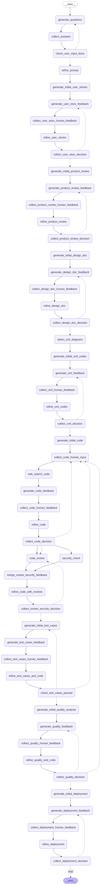

# SDLCv2
LLMs via LangChain SDLC workflow with improve UI UX 
---
title: SDLCv2
emoji: 🏃
colorFrom: gray
colorTo: red
sdk: streamlit
sdk_version: 1.44.0
app_file: app.py
pinned: false
license: apache-2.0
short_description: SDLC v2 improvement in UI and UX
---

Check out the configuration reference at https://huggingface.co/docs/hub/spaces-config-reference

# AI-Powered SDLC Orchestrator (Streamlit App)

[](https://huggingface.co/spaces/shaikhmohammedmujammil/SDLCv2)
[](https://opensource.org/licenses/Apache-2.0)
`sdk: streamlit` `sdk_version: 1.44.0` `app_file: app.py`

## Description

This application orchestrates a simplified Software Development Lifecycle (SDLC) workflow using Large Language Models (LLMs) via LangChain, all within an interactive Streamlit interface. It guides users through key SDLC stages, from initial requirements gathering to deployment planning. AI generates artifacts at each stage, and the workflow incorporates both AI and human feedback loops for iterative refinement.

The core AI logic, state definitions, Pydantic models, and artifact saving/conversion are handled by `SDLC.py`, while `app.py` manages the Streamlit frontend, user interactions, state transitions, and display logic.

## Key Features & UI/UX Improvements

*   **Multi-Stage SDLC Simulation:** Covers requirements, user stories, product review, design, UML, code generation, review & security, testing, quality analysis, and deployment planning.
*   **Cycle-Based Chat History:**
    *   **Problem Solved:** Traditional single chat histories become cluttered and confusing across multiple feedback loops.
    *   **Solution:** Each SDLC cycle (e.g., User Story Refinement, Design Refinement) now maintains its **own distinct chat history**.
    *   **Benefits:** Users can easily track the input-output exchanges *within* a specific cycle, see the latest refined artifact clearly, provide targeted feedback, and make informed decisions (Refine/Approve) without overwhelming history. The history resets when moving to the next major cycle.
*   **Interactive Feedback Loops:** Integrates AI-generated feedback with dedicated human input areas at multiple decision points.
*   **Flexible LLM Configuration:** Select LLM providers (OpenAI, Groq, Google, Anthropic, xAI) and models directly in the UI. API keys are entered securely via password fields.
*   **Tavily Web Search:** Optional integration with Tavily API for web searches during code refinement based on user-reported errors.
*   **Artifact Generation & Saving:**
    *   Creates `.md` files for text artifacts (User Stories, Design Doc, etc.).
    *   Attempts to generate `.pdf` versions of Markdown artifacts using `WeasyPrint` for improved readability and sharing.
    *   Generates `.puml` files for UML diagrams.
    *   Attempts `.png` image generation for UML via `PlantUML` library (requires local Java/PlantUML setup).
    *   Saves code files and instructions, organized into stage-specific folders.
*   **Downloadable Artifacts:** Provides download buttons in the sidebar for:
    *   Key documents (Refined Prompt, User Story, PO Review, Design Doc, QA Report, Deployment Plan) in both **MD and PDF** formats (where PDF generation succeeds).
    *   UML diagrams as `.png` images (if generated successfully).
    *   Code snapshots as `.zip` archives from critical stages (Review, Testing, Final).
    *   A full project `.zip` archive at the end of the workflow.
*   **Workflow Visualization:** Includes a static graph diagram (`SDLC_Workflow_Graph_Diagram.png`) illustrating the general application flow.
*   **Robust State Management:** Uses Streamlit's session state effectively.
*   **Error Handling & Retry:** Uses Tenacity for automatic retries on LLM calls and validation steps, with UI feedback on persistent errors.

## Workflow Diagram


*(This diagram illustrates the general flow of stages and decision points within the application)*

## Technology Stack

*   **Frontend:** Python, Streamlit
*   **Backend Logic:** Python
*   **AI Orchestration:** LangChain (`langchain`, `langchain-core`, `langchain-openai`, `langchain-groq`, `langchain-google-genai`, `langchain-anthropic`)
*   **LLM APIs:** OpenAI, Groq, Google Generative AI, Anthropic, xAI (via OpenAI compatibility)
*   **Web Search:** Tavily API
*   **Markdown -> PDF:** `markdown-it-py`, `WeasyPrint`
*   **UML Generation:** `plantuml` library (requires Java/PlantUML setup for PNGs)
*   **Data Validation:** Pydantic V2
*   **Retry Logic:** Tenacity
*   **Environment Mgmt:** `python-dotenv`
*   **Async Handling:** `nest_asyncio`

## Setup & Local Run

### Prerequisites

*   Python 3.9+
*   Git
*   **For PDF Generation:** System dependencies for `WeasyPrint` (Pango, Cairo, GDK-PixBuf). Installation varies by OS.
    *   **Windows:** Install GTK3 runtime via [MSYS2](https://www.msys2.org/) (install `mingw-w64-x86_64-gtk3` package) and ensure the `msys64/mingw64/bin` directory is added to your system PATH. Restart required.
    *   **macOS:** `brew install pango gdk-pixbuf cairo`
    *   **Linux (Debian/Ubuntu):** `sudo apt-get update && sudo apt-get install -y libpango-1.0-0 libcairo2 libgdk-pixbuf-2.0-0`
*   **For UML PNG Generation (Optional):** Java Runtime Environment (JRE/JDK) installed and added to your system's PATH. Test with `java -version`. You might also need Graphviz (`dot`) for some diagram types.

### Steps

1.  **Clone the Repository:**
    ```bash
    git clone https://huggingface.co/spaces/shaikhmohammedmujammil/SDLCv2
    cd SDLCv2
    ```

2.  **Create Virtual Environment (Recommended):**
    ```bash
    python -m venv venv
    # Activate it:
    # Windows:
    .\venv\Scripts\activate
    # macOS/Linux:
    source venv/bin/activate
    ```

3.  **Install Dependencies:**
    ```bash
    pip install -r requirements.txt
    ```
    *(If you encounter errors here related to WeasyPrint or its dependencies, ensure you've installed the system prerequisites listed above.)*

4.  **Environment Variables (`.env` file - Optional for local convenience):**
    *   Create `.env` in the root directory.
    *   You can add API keys here for local testing *if you modify `app.py` to read them*, but the primary method is via the UI.
        ```dotenv
        # Example (Keys entered in UI are preferred)
        # OPENAI_API_KEY="sk-..."
        # GROQ_API_KEY="gsk_..."
        # GOOGLE_API_KEY="..."
        # ANTHROPIC_API_KEY="..."
        # TAVILY_API_KEY="tvly-..."
        ```
    *   **Important:** Add `.env` to your `.gitignore` file.

5.  **Run the Streamlit App:**
    ```bash
    streamlit run app.py
    ```

6.  **Configure in UI:**
    *   Open the app in your browser (usually `http://localhost:8501`).
    *   Expand "Configuration" in the sidebar.
    *   Select your LLM Provider and Model.
    *   Enter the corresponding LLM API Key.
    *   Enter your Tavily API Key (optional for web search).
    *   Click "Apply Configuration".

7.  **Start Workflow:** After successful configuration, fill out the "Project Configuration" form in the main area and click "Start Workflow". Follow the prompts through each SDLC cycle.

## Configuration (API Keys & Models)

*   Configuration is handled entirely through the **Streamlit UI Sidebar** after launching the app.
*   Select the LLM provider and model.
*   Enter the API keys securely using the password input fields.
*   Click "Apply Configuration" to initialize the backend clients.
*   **Security Note:** Keys entered in the UI are stored only in the active session's memory and are not saved persistently by the application. For deployments, use platform secrets (see Hugging Face guide).

## Hugging Face Spaces Deployment Guide

Deploying to Hugging Face Spaces requires handling secrets and understanding dependency limitations.

### Steps

1.  **Create Space:** Follow the standard procedure on Hugging Face, selecting the "Streamlit" SDK.
2.  **Upload Files:** Use Git (recommended) or the UI uploader to add `app.py`, `SDLC.py`, `requirements.txt`, and optionally `SDLC_Workflow_Graph_Diagram.png` to your Space repo.
3.  **Configure Secrets (CRITICAL):**
    *   Go to your Space **Settings -> Secrets**.
    *   Add secrets for any API keys you want users to *not* have to enter manually every time. Use names like `LLM_API_KEY`, `TAVILY_API_KEY`, `GOOGLE_API_KEY`, etc.
    *   **(Optional but Recommended):** Modify the `st.text_input` calls for API keys in `app.py` to use `os.environ.get("SECRET_NAME", "")` as the default `value`. This pre-fills the fields if the secret exists, but still allows users to override them.
        ```python
        # Example in app.py sidebar
        # llm_key_secret = os.environ.get("YOUR_LLM_SECRET_NAME", "") # Get secret
        # llm_api_key_input = st.text_input(..., value=st.session_state.get("llm_api_key", llm_key_secret))
        ```
4.  **System Dependencies (WeasyPrint/PlantUML):**
    *   **WeasyPrint:** The standard Streamlit environment **lacks the necessary C libraries** (Pango, Cairo, etc.). PDF generation **will fail** unless you deploy using a custom **Dockerfile** that installs these system dependencies. Create a `Dockerfile` in your repo (see WeasyPrint/HF Docker guides) and point your Space settings to use it instead of the default SDK.
    *   **PlantUML:** PNG generation requires **Java**, which is also **not included** by default. This will fail unless using a custom Dockerfile that includes a JRE/JDK.
    *   **Simplest Approach:** Accept that PDF and UML PNG generation may not work on the default HF Space environment. The app will still function, saving `.md` and `.puml` files. You can modify `SDLC.py` to gracefully skip these conversions or update UI captions.
5.  **Check Build & Runtime Logs:** Monitor logs in your Space for installation or startup errors.

## Limitations & Future Work

*   **System Dependencies:** PDF/UML PNG generation requires specific system libraries not present in default cloud environments like HF Spaces unless using custom Docker images.
*   **Error Handling:** While retries are implemented, complex LLM or state errors might necessitate a manual restart via the sidebar button.
*   **State Persistence:** Workflow progress is lost when the session ends.
*   **Context Limits:** Long documents or codebases might exceed LLM context windows, potentially impacting the quality of later-stage artifacts.
*   **UML Feedback UI:** Human feedback for UML is currently collected globally, not per-diagram.

## Contributing

(Optional: Add contribution guidelines)

## License

This project is licensed under the Apache License 2.0 - see the [LICENSE](LICENSE) file for details (or link to standard license text).
